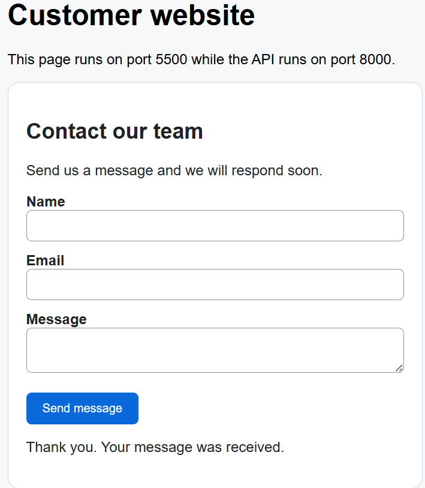
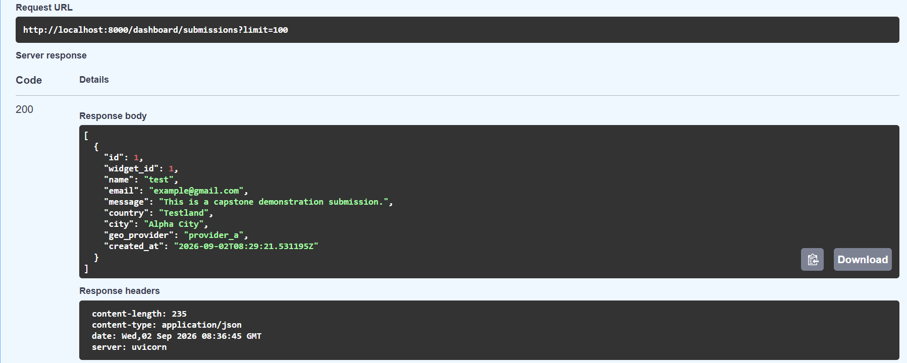
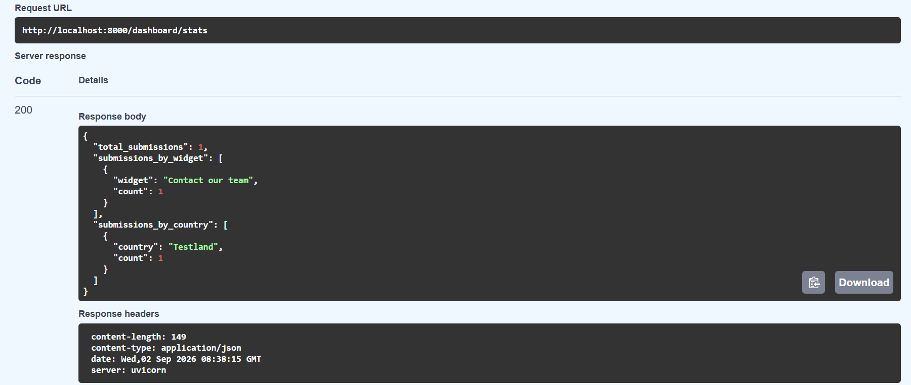
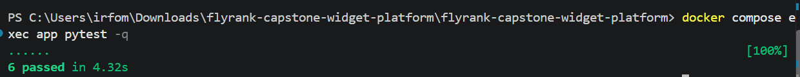

# Embeddable Widget & Lead-Capture Platform

A FastAPI/PostgreSQL capstone that lets authenticated owners create tenant-isolated contact widgets, install them with one script tag, receive hardened cross-origin submissions, and view leads and analytics.

## Core capabilities

- Owner signup/login with Argon2 password hashing and JWT bearer authentication
- Tenant-isolated widget CRUD and non-sequential public IDs
- One-line embed snippet and minimal versioned JavaScript widget
- Public configuration with short caching and immutable script caching
- CORS preflight and second-origin submission support
- Pydantic boundary validation and an 8 KiB request-body limit
- Per-IP/per-widget burst limiting and honeypot spam filtering
- Provider A -> Provider B -> no-geo fallback chain
- Transactional lead and background-job creation
- Idempotent submissions using a database uniqueness constraint
- Retrying background confirmation job whose failure cannot undo storage
- Owner-only lead listing and aggregate statistics
- Docker, migration SQL, seed command, Swagger, tests, and submission evidence

## Architecture

```text
Widget owner -> authenticated widget CRUD -> PostgreSQL -> embed snippet

Customer page (localhost:5500)
  -> widget.v1.js (public, immutable cache)
  -> public config (60-second cache)
  -> rendered form

Visitor submit
  -> CORS/body limit/Pydantic validation
  -> rate limit + idempotency + honeypot
  -> geo provider A -> provider B -> no geo
  -> store lead + background job transaction
  -> success response
  -> background confirmation retry/failure alert

Owner -> authenticated dashboard -> owner-scoped leads and statistics
```

More design detail is in [DESIGN.md](DESIGN.md).

## Repository structure

```text
app/
  routers/          HTTP endpoints
  services/         rate limit, geo fallback, background jobs
  static/           versioned embeddable widget
  auth.py           password/JWT authentication
  database.py       SQLAlchemy session
  models.py         persistent schema
  schemas.py        boundary validation
  seed.py           deterministic demo data
customer-site/      second-origin test page
migrations/         PostgreSQL schema and indexes
tests/              deterministic acceptance tests
BUILDLOG.md          honest AI usage record
DESIGN.md            one-page design
EVIDENCE.md          requirement-by-requirement proof
capstone.yaml        evaluator manifest
```

## Quick start

Requirements: Docker Desktop and Docker Compose. No credit card or cloud account is required.

```bash
git clone https://github.com/FANIZO/flyrank-capstone-widget-platform.git
cd flyrank-capstone-widget-platform
docker compose up --build
```

The API is available at <http://localhost:8000> and Swagger at <http://localhost:8000/docs>.

In a second terminal, create deterministic demo data:

```bash
docker compose exec app python -m app.seed
```

The seed prints a `public_id` and complete script snippet. Replace `PUBLIC_ID` in `customer-site/index.html`, then serve the customer page from a second origin:

```bash
python -m http.server 5500 --directory customer-site
```

Open <http://localhost:5500> and submit the rendered form. Demo owner credentials are printed by the seed command and are only for local evaluation.

## Optional environment overrides

The Docker defaults are safe only for local evaluation. Copy `.env.example` to `.env` to override them. Use a long random `JWT_SECRET` outside local development and never commit `.env`. The public lead endpoint defaults to wildcard CORS without credentials because the widget is designed for arbitrary customer sites; a controlled installation can replace `ALLOWED_ORIGINS=*` with a comma-separated allowlist.

Geo modes are `success` (deterministic mock), `fail`, or `real`. Deterministic modes prove the fallback without depending on network state. `real` uses ip-api.com followed by ipapi.co.

## API reference

| Method | Endpoint | Access | Purpose |
|---|---|---|---|
| `GET` | `/health` | Public | Health probe |
| `POST` | `/auth/signup` | Public | Create owner |
| `POST` | `/auth/login` | Public | Return bearer token |
| `POST` | `/widgets` | Owner | Create widget |
| `GET` | `/widgets` | Owner | List only owner's widgets |
| `GET` | `/widgets/{id}` | Owner | Read owned widget |
| `PATCH` | `/widgets/{id}` | Owner | Update owned widget |
| `DELETE` | `/widgets/{id}` | Owner | Delete owned widget |
| `GET` | `/widgets/{id}/snippet` | Owner | Generate embed line |
| `GET` | `/public/widgets/{public_id}/config` | Public | Cached safe configuration |
| `GET` | `/assets/widget.v1.js` | Public | Versioned widget bundle |
| `POST` | `/public/widgets/{public_id}/submissions` | Public | Capture validated lead |
| `GET` | `/dashboard/submissions` | Owner | List owner-scoped leads |
| `GET` | `/dashboard/stats` | Owner | Aggregate owner statistics |

Protected endpoints use:

```text
Authorization: Bearer <access_token>
```

Public submission requests require a stable retry key:

```text
Idempotency-Key: 6f60a24d-0ff9-44b6-8a38-724fbc160922
```

## Cache policy

- `widget.v1.js`: `Cache-Control: public, max-age=31536000, immutable`
- Widget configuration: `Cache-Control: public, max-age=60`

A changed script must be released under a new filename such as `widget.v2.js`.

## Abuse and resilience behavior

- More than five submissions from the same IP to the same widget within 60 seconds returns `429`.
- A non-empty hidden `company_website` field is treated as spam and is not stored.
- Malformed fields return clean `422` JSON; declared bodies above 8 KiB return `413`.
- Provider A failure tries B; both failing still stores the submission without location.
- A notification job retries twice, records final failure, and logs `BACKGROUND_JOB_FAILURE` without changing the stored lead.
- Reusing an idempotency key for the same widget returns the original submission instead of duplicating it.

## Tests

Run the deterministic acceptance suite:

```bash
docker compose exec app pytest -q
```

The suite covers authentication, tenant isolation, caching, CORS preflight, malformed/oversized input, idempotency, dashboard visibility, honeypot spam, rate limiting, geo fallback, and side-effect failure.

Latest verified result:

```text
......                                                                   [100%]
6 passed in 4.34s
```

## Demonstration evidence

### Widget rendered and submission accepted on the second origin



### Stored lead visible to its authenticated owner



### Owner-only aggregate statistics



### Complete automated acceptance suite



## Submission documents

- [EVIDENCE.md](EVIDENCE.md): automated proof and manual browser checklist
- [BUILDLOG.md](BUILDLOG.md): AI assistance, corrections, and learning
- [capstone.yaml](capstone.yaml): evaluator commands and endpoints

## Limitations

- The in-process rate limiter is appropriate for one local API process, not a multi-instance deployment; production would use Redis or a database-backed limiter.
- Proxy IP headers are not trusted by default; production requires a configured trusted reverse proxy.
- Geo providers are mocked by default for deterministic proof, with optional real modes.
- Confirmation is a console side effect rather than real email.
- The widget intentionally supports a minimal contact form rather than a full visual form builder.
- Hosting and a real CDN are outside the capstone's required local scope.

## License

MIT
